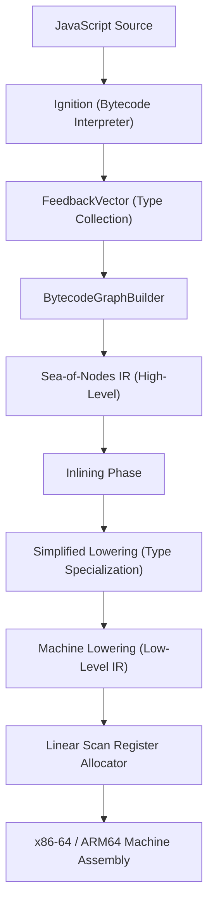

# 02. TurboFan JIT Compiler Mechanics & Assembly Lowering

To write code that compiles to the fastest possible machine code, we must understand the transformation pipeline of V8's optimizing compiler, **TurboFan**.



---

## 2.1 The Sea-of-Nodes Intermediate Representation (IR)

Unlike traditional compilers (GCC, LLVM) that use linear Basic Blocks with Control Flow Graphs (CFG), TurboFan uses a **Sea-of-Nodes** representation.

In a Sea-of-Nodes graph:
- **Value Edges (Data Flow)**: Connect operators directly to their dependencies without specifying execution order.
- **Control Edges**: Dictate branching, loops, and function entry/exit.
- **Effect Edges**: Model sequential side-effects (memory reads, memory writes, and bounds checks).

Because data operations are not bound to strict statement sequences, TurboFan can perform aggressive **Dead Code Elimination**, **Common Subexpression Elimination (CSE)**, **Loop Invariant Code Motion (LICM)**, and **Global Value Numbering (GVN)**.

---

## 2.2 Lowering `Math.imul`: From AST to 1-Cycle x86 Assembly

Let us trace how the simple expression `Math.imul(a, b) >>> 0` travels through the entire TurboFan pipeline:

```
Stage 1: Ignition Bytecode
-------------------------------------------------------------
Ldar a
Mul r1, [0]               ; Speculative multiplication bytecode

Stage 2: Simplified Lowering Phase
-------------------------------------------------------------
When TurboFan inspects Math.imul:
Node #42: Int32Mul(Parameter(a), Parameter(b)) -> Type: Range(kMinInt, kMaxInt)
Node #43: ChangeInt32ToUint32(Node #42)        -> Type: Range(0, kMaxUInt32)

Stage 3: Instruction Selection (x86-64 Architecture)
-------------------------------------------------------------
Int32Mul lowers directly to the opcode: kX64Imull
ChangeInt32ToUint32 becomes a zero-cost register alias in x86-64!

Stage 4: Final Machine Assembly (x86-64)
-------------------------------------------------------------
imull %esi, %edi          ; Single-cycle 32-bit hardware multiply
movl  %edi, %eax          ; Return result in %eax
```

On modern CPUs (Intel Alder Lake / Raptor Lake, AMD Zen 3/4/5), `imull` has:
- **Latency**: 3 clock cycles.
- **Reciprocal Throughput**: 1.0 (can start one new multiplication every single clock cycle).
- **Execution Units**: Dispatches directly to Integer ALUs (Port 0 or Port 1) with **0 FPU/SIMD domain crossing penalty**.

---

## 2.3 Register Allocation & The Power of Pipelining

Why does `limb16-pipeline` outperform `limb16-parallel`? The secret lies in TurboFan's **Linear Scan Register Allocator** (`src/compiler/backend/register-allocator.cc`).

An x86-64 CPU has **16 General-Purpose Registers** (`rax`, `rbx`, `rcx`, `rdx`, `rsi`, `rdi`, `rbp`, `rsp`, `r8`–`r15`). Several of these are reserved for V8 runtime duties:
- `rsp`: Hardware Stack Pointer.
- `rbp`: Frame Pointer.
- `r13`: V8 Root Pointer (points to the global isolate heap).
- `r14`: Context Pointer.

This leaves only **10–11 allocatable integer registers** for user variables.

### Register Lifetime Analysis: Parallel vs Pipeline

```
Family 1: limb16-parallel
-------------------------------------------------------------
const p0 = Math.imul(al, bl);   -- Lifetime begins (needs Register R1)
const p1 = Math.imul(ah, bl);   -- Lifetime begins (needs Register R2)
const p2 = Math.imul(al, bh);   -- Lifetime begins (needs Register R3)
const p3 = Math.imul(ah, bh);   -- Lifetime begins (needs Register R4)
const mid = ...                 -- Lifetime begins (needs Register R5)
// Peak live registers: 8 variables alive simultaneously!
// Result: Register pressure spikes; compiler must spill registers to stack.

Family 2: limb16-pipeline
-------------------------------------------------------------
const ll = Math.imul(al, bl);
const hl = Math.imul(ah, bl) + (ll >>> 16);  -- ll can be immediately FREED!
const lh = Math.imul(al, bh) + (hl & 0xffff);-- hl lower 16 bits FREED!
const hh = Math.imul(ah, bh) + (hl >>> 16) + (lh >>> 16);
// Peak live registers: Only 3-4 variables alive simultaneously!
// Result: Zero stack spills; all intermediate values stay permanently in CPU registers.
```

By organizing carry propagation sequentially, `limb16-pipeline` allows TurboFan to aggressively recycle physical registers, eliminating memory store/reload instructions (`movl %eax, -8(%rbp)`).

---

## 2.4 Monomorphic Inlining Mechanics (`limb16-imul-import`)

In candidate `limb16-imul-import`, we defined:
```javascript
// src/u32/mul/index.js
function mul(a, b) {
  return Math.imul(a, b) >>> 0;
}
```

When `wmul` calls `mul(al, bl)`:
1. **FeedbackVector Inlining**: During `InliningPhase`, TurboFan checks the call site in `wmul`. Since `mul` has been executed with consistent numeric types, the feedback slot is **Monomorphic**.
2. **Bytecode Budget**: The bytecode of `mul` is tiny (12 bytes), well under TurboFan's maximum inlining threshold of 196 bytes (`FLAG_max_inlined_bytecode_size`).
3. **Graph Inlining**: TurboFan deletes the `JSCall` node and splices the `Int32Mul` and `ChangeInt32ToUint32` nodes directly into `wmul`'s graph.
4. **Type Specialization**: The explicit `>>> 0` inside `mul` confirms to TurboFan that the result is strictly an unsigned 32-bit integer, allowing TurboFan to optimize out unnecessary signed-to-unsigned conversion checks.

This is why `limb16-imul-import` achieved **242.13 Mops/s**—proving that clean, modular code architectures can achieve zero-cost abstraction in modern V8!

---

## 2.5 The FPU $\leftrightarrow$ GPR Domain Crossing Penalty

In `limb16-float48` and `float64-corrected`, calculations use double-precision floating point numbers ($u \cdot v$).

On x86-64 CPUs, floating-point operations run on **SSE/AVX vector registers** (`xmm0`–`xmm15`), while bitwise operations run on **General-Purpose Registers** (`rax`, `rdx`).

Moving a value between an integer register and a floating-point register requires executing a **domain transfer instruction**:
- `movd %eax, %xmm0`: Moves 32-bit GPR integer to XMM register (latency: 1–2 cycles).
- `cvttsd2si %xmm0, %eax`: Truncating convert double to 32-bit integer (latency: 3–4 cycles).

In `limb16-float48-bitwise-lo`, switching back and forth between float multiplication and bitwise integer limb extraction triggered multiple `cvttsd2si` domain crossings, dropping throughput to **48.96 Mops/s**.

In contrast, `float64-corrected` performs float multiplication once, does float subtraction once, and converts to integer at the very end in a single clean pass, retaining high throughput (**220.21 Mops/s**).

---

In [**Chapter 03: Algorithmic Blueprint for Extended Precision Arithmetic**](03-algorithmic-mastery.md), we extend these compiler optimizations to 64-bit and 128-bit multi-word arithmetic.
