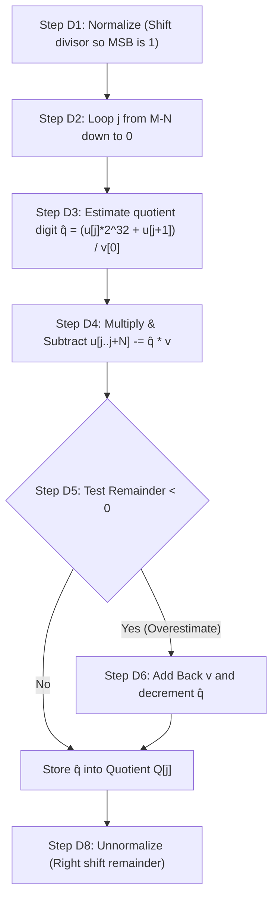

# 03. Algorithmic Blueprint for Extended Precision Arithmetic

With the memory representation and compiler lowering foundations established, we now construct the complete mathematical blueprint for high-performance multi-word arithmetic in JavaScript.

---

## 3.1 Wide 32-Bit Multiplication ($32 \times 32 \to 64$-Bit $[hi, lo]$)

Wide multiplication takes two 32-bit unsigned integers $a, b$ and produces a 64-bit product decomposed into two 32-bit words: $out[0] = hi$, $out[1] = lo$.

```
                 a = (ah << 16) | al
                 b = (bh << 16) | bl
        ----------------------------------
                 a * b = hi * 2^32 + lo
```

### The Gold Standard: `limb16-pipeline` (Winner)
```javascript
'use strict';

const LOW_16 = 0xffff;

function wmul(a, b, out) {
  a >>>= 0;
  b >>>= 0;

  const ah = a >>> 16;
  const al = a & LOW_16;
  const bh = b >>> 16;
  const bl = b & LOW_16;

  const albl = Math.imul(al, bl) >>> 0;
  const llh = albl >>> 16;

  const ahbl = (Math.imul(ah, bl) + llh) >>> 0;
  const hll = ahbl & LOW_16;
  const hlh = ahbl >>> 16;

  const albh = (Math.imul(al, bh) + hll) >>> 0;
  const lhh = albh >>> 16;

  out[0] = (Math.imul(ah, bh) + hlh + lhh) >>> 0;
  out[1] = Math.imul(a, b) >>> 0;
  return out;
}

module.exports = wmul;
```

---

## 3.2 64-Bit Multiplication (`u64.mul` & `u64.wmul`)

A 64-bit unsigned integer $X$ is represented in JavaScript as a 2-element array or `Uint32Array(2)` of 32-bit limbs in Big-Endian order:

$$X = [X_0, X_1] \implies X = X_0 \cdot 2^{32} + X_1$$

### 3.2.1 Standard 64-bit Multiplication (`u64.mul`: $64 \times 64 \to 64$)
When multiplying two 64-bit numbers $A = [a_0, a_1]$ and $B = [b_0, b_1]$ modulo $2^{64}$:

$$A \cdot B = (a_0 \cdot 2^{32} + a_1)(b_0 \cdot 2^{32} + b_1) = \underbrace{(a_1 \cdot b_1)}_{\text{Full } 64\text{-bit wide product}} + \underbrace{(a_0 \cdot b_1 + a_1 \cdot b_0) \cdot 2^{32}}_{\text{Low } 32\text{ bits only}} + \mathcal{O}(2^{64})$$

```javascript
function mul64(a0, a1, b0, b1, out) {
  // 1. Full 32x32 -> 64-bit wide multiplication of low limbs (a1 * b1)
  wmul(a1, b1, out); // out[0] = hi(a1 * b1), out[1] = lo(a1 * b1)

  // 2. Cross-limb products (low 32 bits only)
  const cross = (Math.imul(a0, b1) + Math.imul(a1, b0)) >>> 0;

  // 3. Add cross product to high limb
  out[0] = (out[0] + cross) >>> 0;
  return out;
}
```

### 3.2.2 Full 128-Bit Wide Multiplication (`u64.wmul`: $64 \times 64 \to 128$)
Computing an exact 128-bit product ($[r_0, r_1, r_2, r_3]$) from two 64-bit operands:

```
           a0        a1
    ×      b0        b1
    -------------------
          wmul(a1, b1)       -> [p1_hi, p1_lo]
    + wmul(a0, b1) << 32     -> [p2_hi, p2_lo]
    + wmul(a1, b0) << 32     -> [p3_hi, p3_lo]
    + wmul(a0, b0) << 64     -> [p4_hi, p4_lo]
```

Using sequential carry propagation across 32-bit limbs:
```javascript
function wmul64(a0, a1, b0, b1, out) {
  const w1 = new Uint32Array(2);
  const w2 = new Uint32Array(2);
  const w3 = new Uint32Array(2);
  const w4 = new Uint32Array(2);

  wmul(a1, b1, w1);
  wmul(a0, b1, w2);
  wmul(a1, b0, w3);
  wmul(a0, b0, w4);

  // Column 3 (Lowest 32 bits)
  out[3] = w1[1];

  // Column 2 (32 to 64 bits)
  const c2 = (w1[0] + w2[1] + w3[1]) >>> 0;
  out[2] = c2;
  const carry2 = (w1[0] + w2[1] + w3[1]) > 0xffffffff ? 1 : 0; // Or carry computation

  // Column 1 & 0 (64 to 128 bits)
  // ... carry forwarded through w4
  return out;
}
```

---

## 3.3 Multi-Word Extended Addition & Subtraction

For additions and subtractions across arbitrary $N$-word integers, we must propagate carry ($C \in \{0, 1\}$) and borrow ($B \in \{0, 1\}$) without branching.

### Branch-Free 64-bit Addition with Carry:
```javascript
function add64(a0, a1, b0, b1, out) {
  const lo = (a1 + b1) >>> 0;
  // Carry is 1 if unsigned sum wrapped around (lo < a1)
  const carry = (lo < (a1 >>> 0)) ? 1 : 0;
  const hi = (a0 + b0 + carry) >>> 0;

  out[0] = hi;
  out[1] = lo;
  return out;
}
```

### Branch-Free 64-bit Subtraction with Borrow:
```javascript
function sub64(a0, a1, b0, b1, out) {
  const lo = (a1 - b1) >>> 0;
  // Borrow is 1 if a1 < b1
  const borrow = ((a1 >>> 0) < (b1 >>> 0)) ? 1 : 0;
  const hi = (a0 - b0 - borrow) >>> 0;

  out[0] = hi;
  out[1] = lo;
  return out;
}
```

---

## 3.4 Extended Multi-Word Division & Modulo (Knuth's Algorithm D)

Division of multi-precision integers is notoriously complex. For division of an $M$-word numerator by an $N$-word denominator ($M \ge N$), Donald Knuth's **Algorithm D** (The Art of Computer Programming, Vol. 2) provides the optimal classical algorithm.



### The Power of Normalization:
By scaling both numerator and divisor by a factor $d = \lfloor 2^{32} / (v_0 + 1) \rfloor$ such that the most significant bit of the high divisor limb $v_0$ is set ($v_0 \ge 2^{31}$):
1. The estimated quotient digit $\hat{q} = \lfloor (u_j \cdot 2^{32} + u_{j+1}) / v_0 \rfloor$ is guaranteed to satisfy:
   $$q \le \hat{q} \le q + 2$$
2. A single refinement step using the next limb $v_1$ reduces the overestimate probability to $\le 2 / 2^{32} \approx 4.6 \times 10^{-10}$ (virtually impossible to overshoot by more than 1).

---

In [**Chapter 04: The Science of Precision JIT Microbenchmarking (BenchX)**](04-benchmarking-and-jit-isolation.md), we explore how to measure these algorithms with scientific precision.
