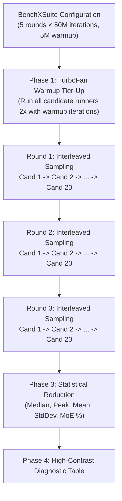

# 04. The Science of Precision JIT Microbenchmarking (BenchX)

> *"Computers are deterministic, but modern execution environments are not. Between dynamic voltage/frequency scaling, JIT tiered compilation, and polymorphic inline cache state, a naive benchmark measures noise, not performance."*

---

## 4.1 The Microbenchmarking Paradox in JIT Environments

When benchmarking C or Rust code compiled with LLVM, the machine code binary is static. In JavaScript, execution is inherently **dynamic and speculative**:
1. Code starts in the **Ignition** bytecode interpreter.
2. After ~1,000 iterations, hot functions are tiered up to the **Sparkplug** non-optimizing baseline compiler.
3. After ~10,000 iterations with consistent type feedback, functions are compiled by **TurboFan** with aggressive speculative inlining.
4. If an unexpected type or Megamorphic call is encountered, TurboFan emits a **Deoptimization (`Deopt`)** and drops the function back to Ignition.

If your benchmark does not explicitly account for these JIT lifecycle stages, your results will measure interpreter tier-up latency rather than peak steady-state throughput.

---

## 4.2 The Five Sins of Naive JavaScript Benchmarking

```
+------------------------------------+---------------------------------------------------------------+
| Naive Mistake                      | Consequence                                                   |
+------------------------------------+---------------------------------------------------------------+
| 1. Shared Function Strings         | Megamorphic IC pollution drops throughput by 8x (~45 Mops/s)  |
| 2. Sequential Candidate Execution  | Thermal throttling penalizes later candidates by 20-30%       |
| 3. Pre-test global.gc() Calls      | Concurrent sweeping threads inject +/-120% timing jitter      |
| 4. Insufficient Warmup Iterations  | TurboFan compilation happens mid-measurement                  |
| 5. Measuring Object Allocations    | Young-generation GC scavenges mask true arithmetic speed     |
+------------------------------------+---------------------------------------------------------------+
```

---

## 4.3 Inside BenchX: Architecture of a Precision JIT Harness

To overcome all five pitfalls, we designed **BenchX** ([`benchx/lib.js`](../../benchx/lib.js)).



---

## 4.4 Monomorphic Compilation Unit Isolation

To prevent V8's `CompilationCache` from sharing FeedbackVectors across candidates:

```javascript
function createMonomorphicRunner(fn, name = 'kernel', isStrided = false, a = 0xdeadbeef) {
  const r = new Uint32Array(2);
  const callExpr = isStrided ? 'fn(r[1], a, r, 1, 0);' : 'fn(r[1], a, r);';
  const cleanName = (name || 'kernel').replace(/[^a-zA-Z0-9]/g, '_');

  // Injecting unique timestamp and random float forces a fresh CompilationCache key
  return new Function(
    'fn',
    'a',
    'r',
    `
    /* [BenchX Monomorphic Compilation Unit: ${cleanName}_${Date.now()}_${Math.random()}] */
    return function benchKernel_${cleanName}(n) {
      r[1] = 1;
      for (let i = 0; i < n; i++) {
        ${callExpr}
      }
      return r;
    };
  `,
  )(fn, a, r);
}
```

Every candidate receives its own pristine TurboFan compilation pipeline, allowing `benchKernel_${cleanName}` to inline `fn` directly into its loop body.

---

## 4.5 Eliminating Code Duplication Across Test Suites

Before BenchX, adding a new candidate required creating a new `.js` file, copying over timing loops, standard deviation formulas, and formatting code.

With BenchX, a new candidate is evaluated in a single declarative line:
```javascript
suite.add('limb16-imul-import', limb16_imul_import);
```

BenchX automatically handles:
- Warmup tier-up.
- Interleaved round-robin sample collection.
- Margin of error calculation ($MoE = \frac{\sigma}{\mu} \times 100\%$).
- Relative speedup computation against the winning baseline.

---

## 4.6 Browser JIT Benchmarking with Web Workers

In browser environments (Chrome, Firefox, Safari), benchmarking on the main UI thread causes two severe distortions:
1. **Event Loop Throttling**: The DOM event loop interrupts long-running JavaScript execution.
2. **Timer Clamping**: Browsers clamp `performance.now()` resolution on the main thread to prevent Spectre/Meltdown timing attacks.

In **BenchX Browser** ([`benchx/browser/`](../../benchx/browser/)):
- Execution is offloaded to an isolated **Web Worker** running on a separate OS core.
- Progress updates are streamed via `postMessage` every round.
- Results are displayed with zero frame drops on the main UI.

---

In [**Chapter 05: The V8 Systems Programmer's Codex**](05-the-v8-systems-codex.md), we distill these findings into the 12 Golden Commandments for writing ultra-fast JavaScript integer code.
