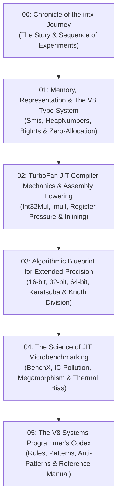

# Extended-Precision Integer Arithmetic in Modern JavaScript (V8 Systems Handbook)

> **An exhaustive, systems-level treatise on writing ultra-high-performance, zero-allocation integer arithmetic kernels for modern JavaScript JIT engines (V8, SpiderMonkey, JavaScriptCore).**

---

## About This Book

This book is a comprehensive, publication-grade manual for systems programmers, cryptographic engineers, compiler enthusiasts, and JavaScript developers seeking to push the absolute limits of JavaScript execution performance.

Drawing on hundreds of millions of empirical samples, TurboFan Intermediate Representation (IR) graphs, x86-64 machine code disassembly, and the architecture of the [`intx`](https://github.com/impawstarlight/intx) library and **BenchX** benchmarking suite, this book explores the boundary between high-level ECMAScript and bare-metal CPU execution.

---

## Chapters

1. [**00. Chronicle of the intx Journey: The Flow of Discovery**](00-chronicle-and-journey.md)
   - Step-by-step narrative of the research: from initial stdlib baselines to discovering the Megamorphic IC bug, developing BenchX, testing 20 wide multiplication candidates, probing BigInt escape analysis, and browser benchmarking.

2. [**01. Memory, Representation & The V8 Type System**](01-v8-memory-and-types.md)
   - Smi (Small Integer) 31-bit pointer tagging on 64-bit architectures.
   - `HeapNumber` boxing, NaN tagging, and the hidden cost of double allocations.
   - The C++ internal memory layout of `BigInt` (`BigIntBase`, `digit_t`, headers).
   - Zero-allocation memory architectures: `Uint32Array`, flat buffer windows, and procedural in-place mutation.

3. [**02. TurboFan JIT Compiler Mechanics & Machine Lowering**](02-turbofan-lowering-and-assembly.md)
   - The Ignition $\to$ TurboFan pipeline: Bytecode, BytecodeGraphBuilder, and the Sea-of-Nodes IR.
   - FeedbackVectors and Inline Cache states: Monomorphic, Polymorphic, and Megamorphic.
   - SimplifiedLowering: How `Math.imul` translates to `Int32Mul` and lowers to 1-cycle x86-64 `imull`.
   - LinearScan register allocation: Liveness intervals, register spilling, and CPU register pressure.
   - TurboFan Inlining heuristics and zero-cost modular abstractions.
   - The FPU $\leftrightarrow$ GPR execution domain crossing penalty (`Float64ToUint32`, `cvttsd2si`).

4. [**03. Algorithmic Blueprint for Extended Precision Arithmetic**](03-algorithmic-mastery.md)
   - Mathematical taxonomy of wide multiplication ($32 \times 32 \to 64$-bit $[hi, lo]$):
     - `limb16-parallel` (4 partial products).
     - `limb16-pipeline` (3-stage carry chain).
     - `limb16-float48` (asymmetric float mantissa).
     - `float64-corrected` (analytical residual scaling).
     - `bigint` (oracle & hybrid extraction).
   - Extending to 64-bit (`u64.mul`, `u64.wmul`) and 128-bit (`u128.mul`, `u128.wmul`) via multi-word schoolbook and Karatsuba.
   - Extended-precision division and modulo: Knuth's Algorithm D in pure JavaScript.
   - Constant-time carry and borrow chains for extended additions and subtractions.

5. [**04. The Science of Precision JIT Microbenchmarking (BenchX)**](04-benchmarking-and-jit-isolation.md)
   - Why BenchX was built: Code deduplication + statistical rigor.
   - The Megamorphic Inline Cache trap: Why naive benchmarking slows code by $8\times$.
   - Monomorphic JIT isolation via dynamic compilation unit tagging (`/* [CompilationUnit: ...] */`).
   - Round-robin interleaved sampling to eliminate CPU thermal throttling and frequency scaling bias.
   - The `--expose-gc` trap: Background concurrent sweeping thread contention.
   - Web Worker browser benchmarking in Chrome (V8), Firefox (SpiderMonkey), and Safari (JSC).

6. [**05. The V8 Systems Programmer's Codex**](05-the-v8-systems-codex.md)
   - The 12 Golden Commandments for writing V8-optimized integer code.
   - Essential optimization patterns vs catastrophic anti-patterns.
   - Complete quick-reference cheat sheet for extended-precision JavaScript.
