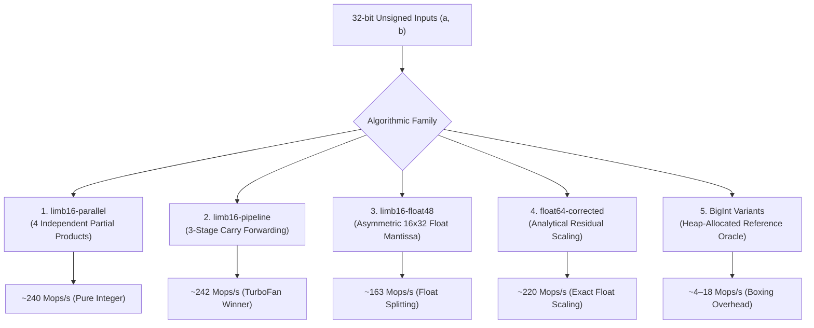

# The Anatomy of Ultra-Fast 64-Bit Integer Arithmetic in Pure JavaScript

> **A Comprehensive Technical Monograph on Algorithmic Taxonomy, JIT Compilation Mechanics, and Precision Microbenchmarking in Modern JavaScript Engines.**

---

## Executive Summary

JavaScript is ubiquitously perceived as a high-level, dynamically typed language ill-suited for systems-level integer arithmetic. Because JavaScript numbers are double-precision IEEE 754 floating-point values with a 53-bit mantissa ($2^{53} - 1$), computing an exact 64-bit wide product ($32 \times 32 \to 64$-bit $[hi, lo]$) has historically been an algorithmic obstacle for cryptographic primitives, multi-precision bignum libraries, hashing engines, and emulation kernels.

This monograph documents an in-depth empirical and theoretical investigation into wide integer multiplication (`u32.wmul`), conducted during the engineering of the [`intx`](https://github.com/impawstarlight/intx) library. Through 20 evolutionary algorithmic variations spanning 5 distinct mathematical families, we analyze how V8 TurboFan lowers JavaScript constructs to x86-64 machine instructions, why native `BigInt` fails to escape-analyze into 64-bit CPU registers, and how to construct a statistically rigorous microbenchmarking harness (**BenchX**) that eliminates Inline Cache (IC) pollution and thermal skew.

---

## Table of Contents

1. [**Chapter 1: The JavaScript Integer Paradox & The 64-Bit Arithmetic Barrier**](ch1-the-64bit-problem.md)
   - The IEEE 754 53-bit mantissa constraint ($2^{53}-1$ vs $2^{64}-1$).
   - Real-world systems demands: Cryptography, hashing, multi-word arithmetic, and emulation.
   - The procedural zero-allocation contract: Mutating destination buffers to eliminate GC pauses.

2. [**Chapter 2: The 5 Algorithmic Families — A Mathematical & Evolutionary Taxonomy**](ch2-algorithmic-taxonomy.md)
   - **Family 1 (`limb16-parallel`)**: 4-quadrant partial products and multi-column bitwise carries.
   - **Family 2 (`limb16-pipeline`)**: 3-stage sequential carry forwarding minimizing register pressure.
   - **Family 3 (`limb16-float48`)**: Asymmetric 16x32 limb deconstruction in 48-bit exact float mantissas.
   - **Family 4 (`float64-corrected`)**: Exact double-precision multiplication with analytical residual scalar bias correction.
   - **Family 5 (`bigint`)**: From naive masking to `BigInt.asUintN(64)` and hybrid low-word delegation.

3. [**Chapter 3: Under the Hood: V8 TurboFan, Machine Lowering & Compiler Mechanics**](ch3-v8-compiler-mechanics.md)
   - Why `Math.imul` lowers to 1-cycle `imull` x86 instructions.
   - The BigInt escape analysis wall: Heap allocations, `HeapNumber` digit arrays, and why TurboFan cannot unbox BigInts to `imulq`.
   - Function inlining and zero-cost modular abstractions (`limb16-imul-import`).

4. [**Chapter 4: BenchX & The Science of Precision Microbenchmarking**](ch4-benchx-and-microbenchmarking.md)
   - The genesis of BenchX: Eliminating benchmark code duplication while enforcing scientific isolation.
   - The Megamorphic Inline Cache (IC) Bug: How V8 compilation cache sharing can degrade benchmark performance by $8\times$.
   - Monomorphic JIT isolation via dynamic compilation unit tagging.
   - Round-robin interleaved sampling for thermal normalization.
   - The `--expose-gc` fallacy and background sweeping jitter.

5. [**Chapter 5: Cross-Runtime Realities, Browser Engines & Future Directions**](ch5-cross-runtime-and-future.md)
   - Web Worker architecture for zero-freeze browser microbenchmarking.
   - Performance across engines: Google Chrome (V8), Mozilla Firefox (SpiderMonkey), Apple Safari (JavaScriptCore).
   - The definitive decision matrix and developer cheat sheet.

---

## Grand Performance Matrix (Node v24.19.0, x64)

| Rank | Candidate Kernel | Algorithmic Family | Median Throughput | Peak Throughput | MoE (±%) | Relative Speedup |
| :---: | :--- | :--- | :---: | :---: | :---: | :---: |
| 🥇 **1** | [`limb16-imul-import`](ch2-algorithmic-taxonomy.md#family-2-limb16-pipeline) | `limb16-pipeline` | **242.13 Mops/s** | **275.50 Mops/s** | ±8.0% | **1.00x (baseline)** |
| 🥈 **2** | [`limb16-pipeline-imul-cached`](ch2-algorithmic-taxonomy.md#family-2-limb16-pipeline) | `limb16-pipeline` | **240.20 Mops/s** | **260.70 Mops/s** | ±3.8% | 0.99x |
| 🥉 **3** | [`limb16-pipeline-imul-lo`](ch2-algorithmic-taxonomy.md#family-2-limb16-pipeline) | `limb16-pipeline` | **240.12 Mops/s** | **271.12 Mops/s** | ±6.1% | 0.99x |
| 4 | [`limb16-parallel-imul-cached`](ch2-algorithmic-taxonomy.md#family-1-limb16-parallel) | `limb16-parallel` | **239.04 Mops/s** | **269.79 Mops/s** | ±5.4% | 0.99x |
| 5 | [`limb16-parallel-imul-all`](ch2-algorithmic-taxonomy.md#family-1-limb16-parallel) | `limb16-parallel` | **238.55 Mops/s** | **263.01 Mops/s** | ±4.5% | 0.99x |
| 6 | [`limb16-pipeline-imul-all`](ch2-algorithmic-taxonomy.md#family-2-limb16-pipeline) | `limb16-pipeline` | **238.31 Mops/s** | **268.61 Mops/s** | ±5.5% | 0.98x |
| 7 | [`limb16-parallel-imul-lo`](ch2-algorithmic-taxonomy.md#family-1-limb16-parallel) | `limb16-parallel` | **237.71 Mops/s** | **270.76 Mops/s** | ±5.8% | 0.98x |
| 8 | [`float64-corrected`](ch2-algorithmic-taxonomy.md#family-4-float64-corrected) | `float64` | **220.21 Mops/s** | **238.05 Mops/s** | ±4.6% | 0.91x |
| 9 | [`limb16-float48-imul-lo`](ch2-algorithmic-taxonomy.md#family-3-limb16-float48) | `limb16-float48` | **163.37 Mops/s** | **165.15 Mops/s** | ±1.1% | 0.67x |
| 10 | [`stdlib/umuldw.assign`](ch2-algorithmic-taxonomy.md) | `stdlib` (reference) | **148.12 Mops/s** | **152.71 Mops/s** | ±7.2% | 0.61x |
| 11 | [`limb16-pipeline-bitwise-lo`](ch2-algorithmic-taxonomy.md#family-2-limb16-pipeline) | `limb16-pipeline` | **137.17 Mops/s** | **152.00 Mops/s** | ±5.0% | 0.57x |
| 12 | [`limb16-parallel-bitwise-lo`](ch2-algorithmic-taxonomy.md#family-1-limb16-parallel) | `limb16-parallel` | **131.27 Mops/s** | **149.39 Mops/s** | ±7.2% | 0.54x |
| 13 | [`limb16-float48-bitwise-lo`](ch2-algorithmic-taxonomy.md#family-3-limb16-float48) | `limb16-float48` | **48.96 Mops/s** | **54.77 Mops/s** | ±5.0% | 0.20x |
| 14 | [`bigint-hi`](ch2-algorithmic-taxonomy.md#family-5-bigint) | `bigint` (hybrid) | **17.56 Mops/s** | **18.47 Mops/s** | ±9.7% | 0.07x |
| 15 | [`bigint-as-uint64-imul-lo`](ch2-algorithmic-taxonomy.md#family-5-bigint) | `bigint` (hybrid) | **17.48 Mops/s** | **18.34 Mops/s** | ±2.2% | 0.07x |
| 16 | [`bigint-as-uintn-module-const`](ch2-algorithmic-taxonomy.md#family-5-bigint) | `bigint` (module const) | **10.72 Mops/s** | **11.00 Mops/s** | ±2.8% | 0.04x |
| 17 | [`bigint-as-uintn-local-const`](ch2-algorithmic-taxonomy.md#family-5-bigint) | `bigint` (local const) | **10.68 Mops/s** | **11.41 Mops/s** | ±4.2% | 0.04x |
| 18 | [`bigint-as-uintn-literal`](ch2-algorithmic-taxonomy.md#family-5-bigint) | `bigint` (literal) | **10.53 Mops/s** | **10.97 Mops/s** | ±2.0% | 0.04x |
| 19 | [`bigint-as-uint32`](ch2-algorithmic-taxonomy.md#family-5-bigint) | `bigint` (cast lo) | **4.74 Mops/s** | **4.88 Mops/s** | ±3.7% | 0.02x |
| 20 | [`bigint-literal-mask`](ch2-algorithmic-taxonomy.md#family-5-bigint) | `bigint` (mask lo) | **4.17 Mops/s** | **4.31 Mops/s** | ±4.6% | 0.02x |

---

## Quick Navigation

- Start reading with [**Chapter 1: The JavaScript Integer Paradox & The 64-Bit Barrier**](ch1-the-64bit-problem.md).
- Explore the interactive browser benchmark live with `npm run bench:browser` or by opening [`benchx/browser/index.html`](file:///Stuff/GSoC/intx/benchx/browser/index.html).
